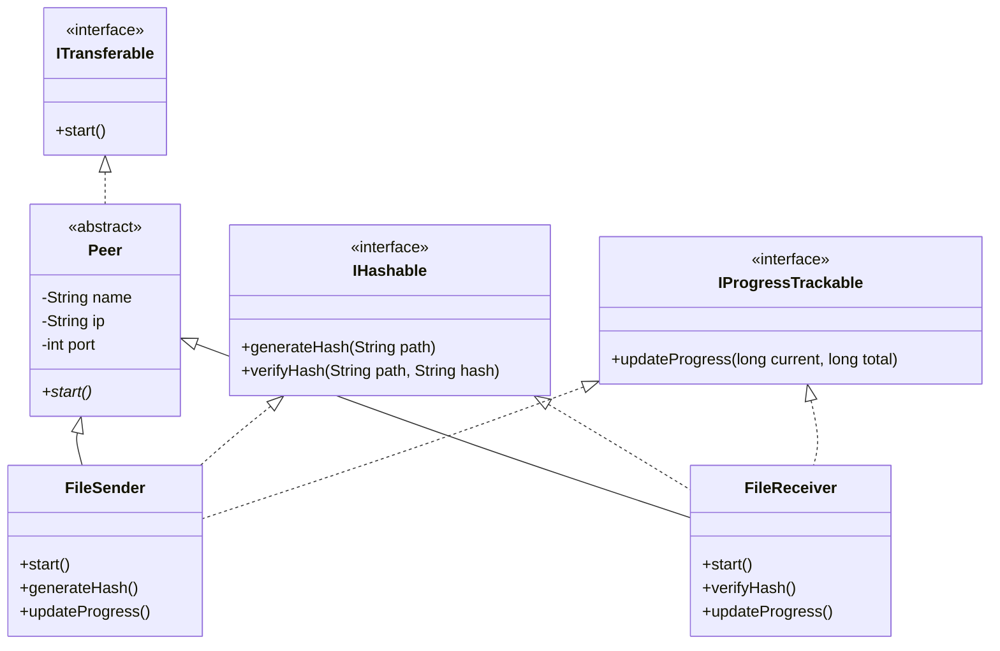

# BLUEPRINT 🏗️

The technical architecture of Swift is designed around modularity, separation of concerns, and clean inheritance.

### 🏛️ System Architecture

Swift uses an interface-first approach. By decoupling the core logic into discrete interfaces, the system remains extensible and easy to test.

---

### 🧩 Core Interfaces

1.  **`ITransferable`**: Defines the fundamental lifecycle of a network node. Every `Peer` must implement `start()` to initiate its role.
2.  **`IHashable`**: Decouples integrity verification from network logic. It ensures that any file sent or received can be validated against a cryptographic signature.
3.  **`IProgressTrackable`**: Provides a standardized way to relay transfer status to the UI/Console, allowing for live progress bars.

---

### 🛠️ Libraries & Dependencies

Swift relies exclusively on the **Java Standard Library** to ensure zero external dependencies and maximum portability.

- **`java.net`**: Handles the TCP/IP socket connections. We use `ServerSocket` for listeners and `Socket` for initiators.
- **`java.io`**: Manages the data streams. `DataInputStream` and `DataOutputStream` are used to wrap the raw socket streams for typed data exchange (Strings, Longs, Booleans).
- **`java.security`**: Powers the integrity engine. We use the `MessageDigest` class specifically with the **SHA-256** algorithm to generate byte-level signatures.

---

### 🧪 Design Decisions

- **Abstract Base Class (`Peer`)**: We use an abstract class to store common metadata like name, IP, and port, while forcing specialized behavior in subclasses.
- **Buffer Optimization**: The transfer loop uses a `64KB` (65,536 bytes) byte array. This specific size was chosen to balance memory usage and throughput, taking advantage of modern network card window sizes.
